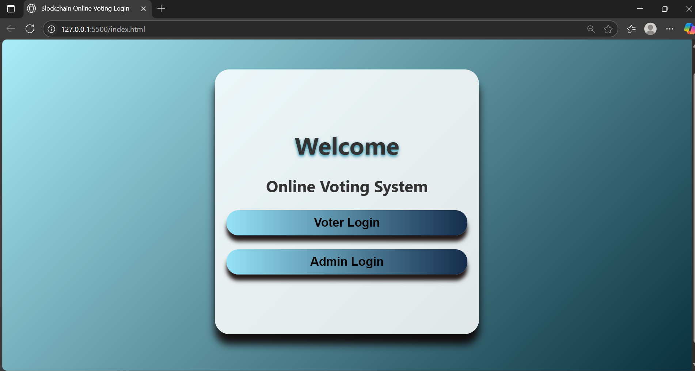
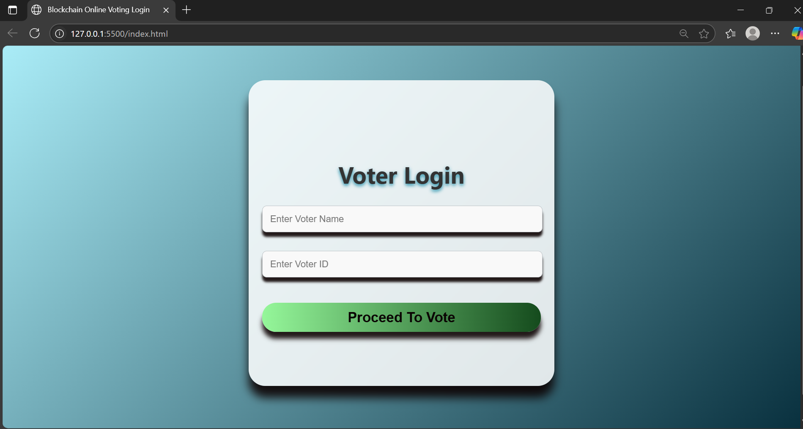
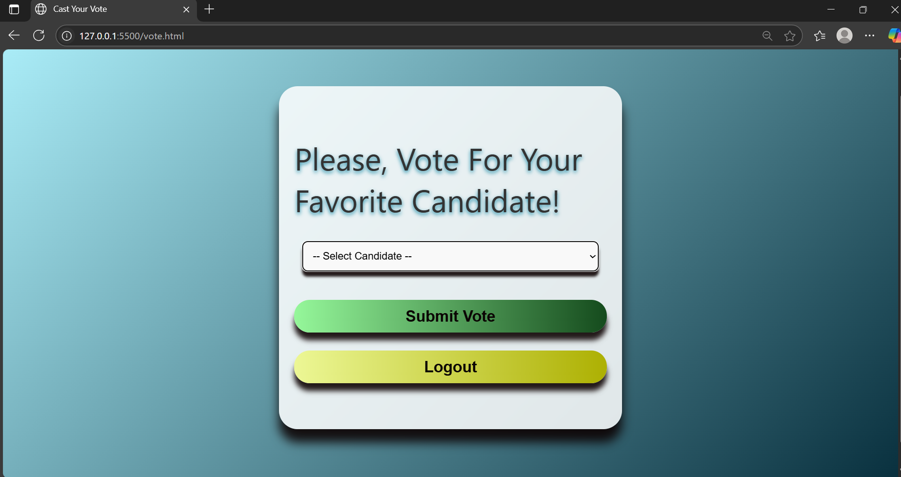
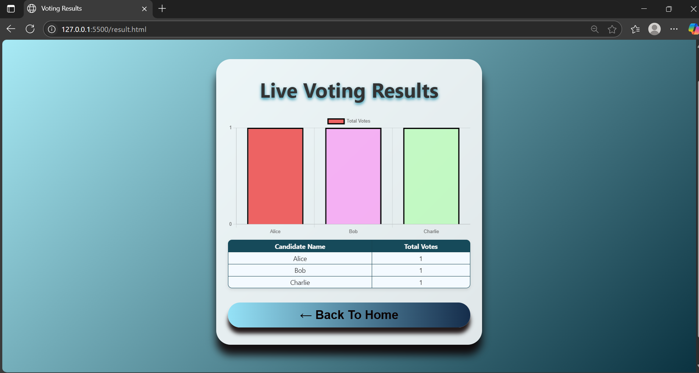
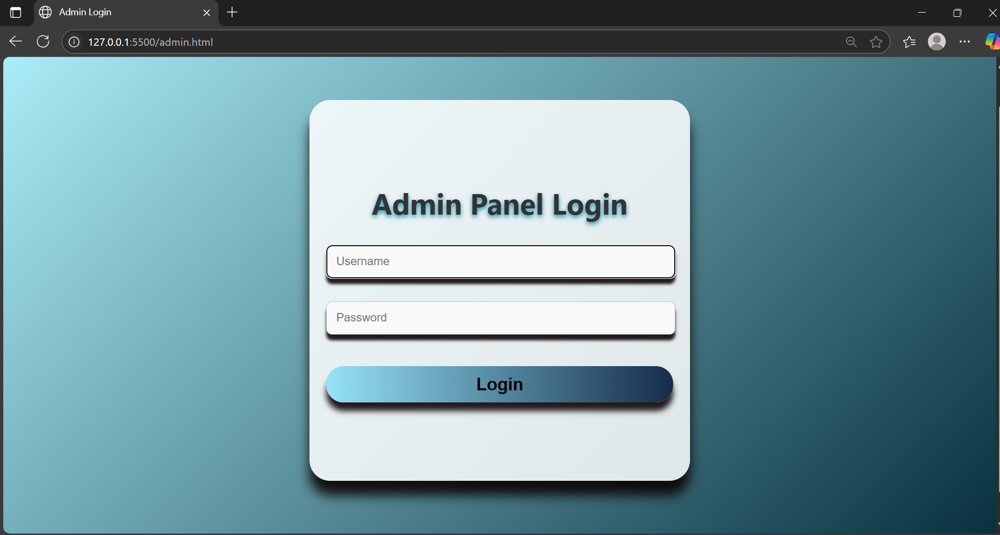
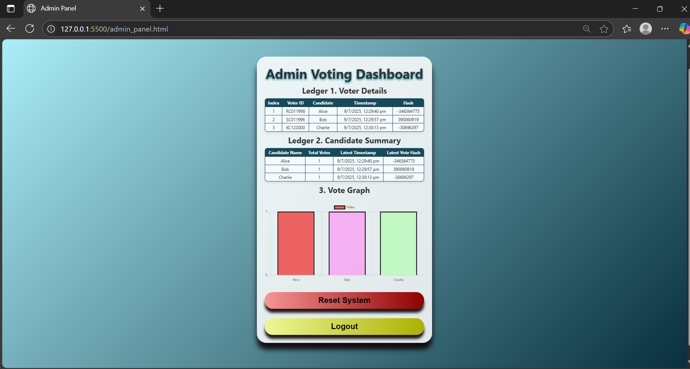

# Blockchain-Based-Online-Voting-System
Blockchain Based Online Voting System is a dynamic web application that reimagines digital elections with security, transparency, and trust. This project is built using HTML, CSS, and JavaScript to enable tamper-proof digital voting.

---

## 📌 Features

- 🔐  Blockchain-based vote storage to ensure tamper-proof and secure elections
- 👤 Separate interfaces for voters and admin with proper access roles
- 🗳️ Real-time vote casting and tracking
- 📊  Admin panel shows live vote counts and results
- 🎨 Styled with CSS to create attractive and eye-catching web pages

---

## 📁 Project Files

| File Name             | Description                                  |
|-----------------------|----------------------------------------------|
| `index.html`          | Login or Home page for voters                |
| `vote.html`           | Voting page for casting votes                |
| `admin.html`          | Admin login interface                        |
| `admin_panel.html`    | Admin dashboard showing votes and results    |
| `result.html`         | Displays final voting results                |
| `blockchain.js`       | Handles blockchain logic for vote storage    |
| `style.css`           | Styling for all HTML pages                   |

---

## ⚙️ How It Works

1. Voter opens the application and logs in via `index.html` page.
2. They cast their vote using the `vote.html` page.
3. The vote is stored as a block in the blockchain via `blockchain.js`.
4. Admin logs in through `admin.html` and accesses the dashboard `admin_panel.html` to view the vote summary and results.
5. Final results are displayed on the results page `result.html`.

---

## 🚀 Getting Started

1. **Clone the repository**:
   
   git clone https://github.com/Kankana1012/Blockchain-Based-Online-Voting-System.git
   

2. **Open `index.html`** in your browser.

> 💡 No server setup needed. It’s a front-end-only demo application.

---

## 🛠️ Tech Stack

---

## 📸 Screenshots

#### 🏠 Home Page

### 🔐 Voter Login Page

### 🗳️ Voting Page

#### 📊 Results Page

#### 🔐 Admin Login

### 👤 Admin Dashboard

---

## 🙌 Acknowledgments

This project was created as an academic prototype to explore blockchain's potential in secure voting systems. It is a front-end simulation and does not use a live blockchain or backend service.

---

## 📬 Contact

**Developer:** Kankana Chakraborty  
**Email:** lushichakraborty@gmail.com  
**GitHub:** [kankana1012](https://github.com/Kankana1012)  
**LinkedIn:** [linkedin.com/in/kankana-chakraborty](https://linkedin.com/in/kankana-chakraborty)

---

> ⭐ If you like this project, feel free to fork it and give it a star!
